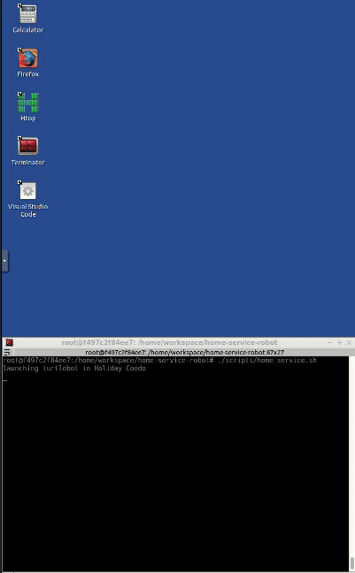
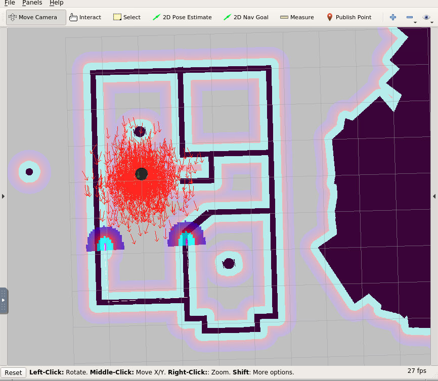
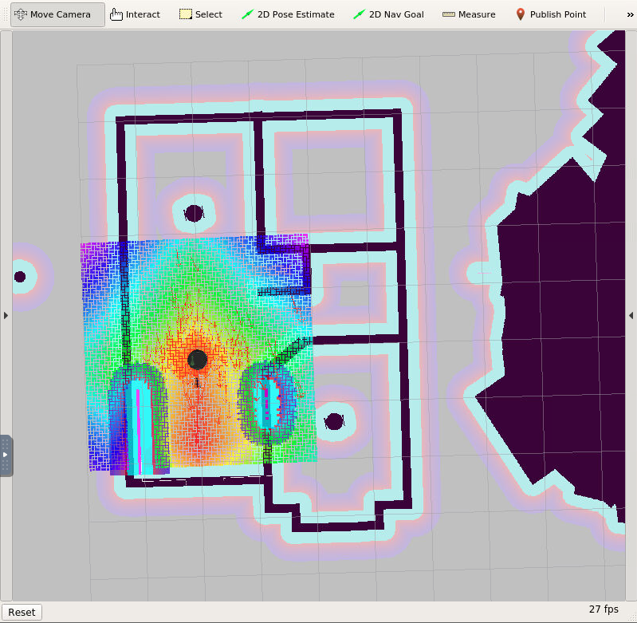
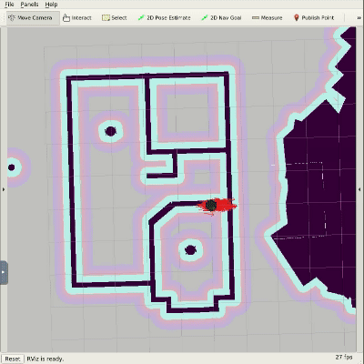
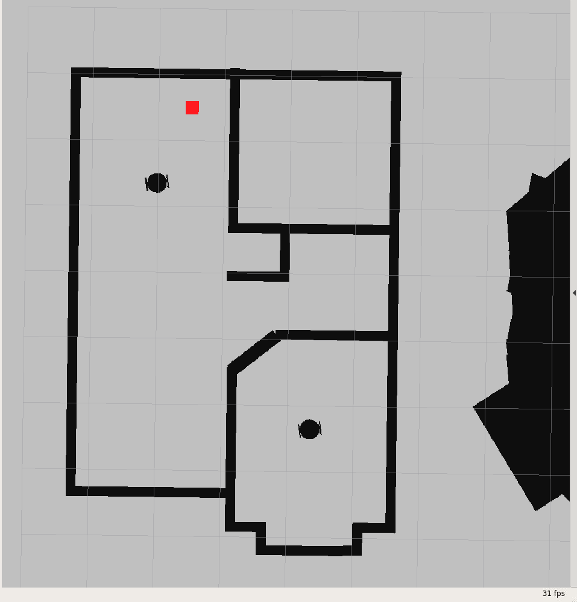
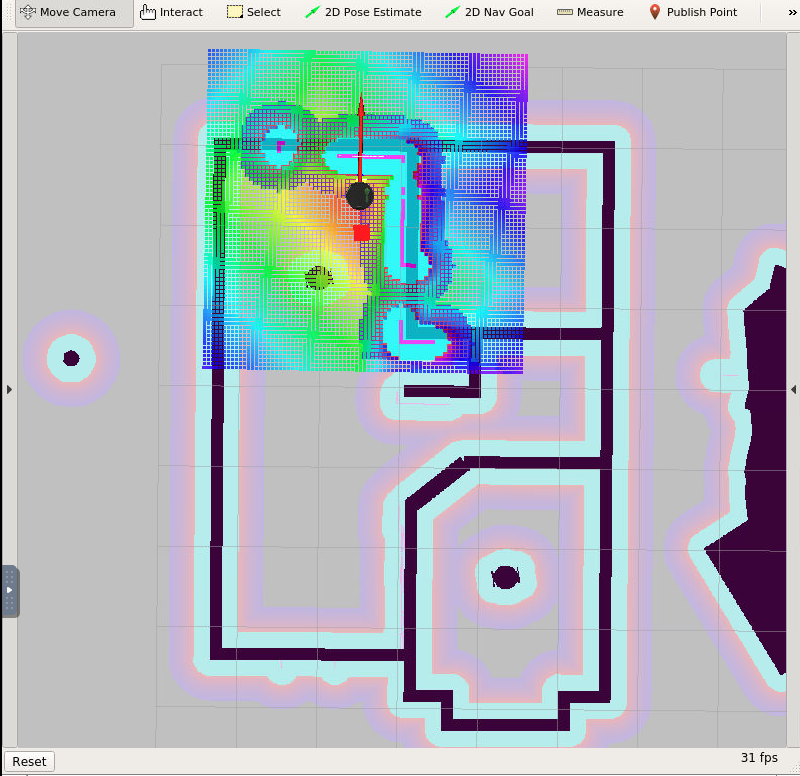

# Home Service Robot Project

### Demo



## Goal

The goal of this project was to program a home-service-robot that will map its
environment and autonomously navigate to a pickup and drop-off locations. For this one
needed to:

* Design robot's environment with the Building Editor in Gazebo.
* Tele-operate the robot and manually test SLAM.
* Use the ROS navigation stack and manually command the robot using the 2D Nav Goal
  arrow in RViz to move to 2 different desired positions and orientations.
* Write a `pick_objects` node that commands the robot to move to the desired pickup and
  drop off zones.
* Write an `add_markers` node that subscribes to the robot odometry and publishes
  pick-up and drop-off markers to RViz.
* Modify the `add_markers` node to:
    1. Drop-off the marker at given position
    1. Detect marker pickup by tracking the robot's pose using `/amcl_pose`
    1. Detect marker drop-off

### Install Requirements

* Ubuntu 16.04 OS with cmake (>=3.11) and g++/gcc (>=9.0) packages
* Gazebo >= 7.0
* ROS Kinetic

```sh
git clone https://github.com/daniel-m-campos/home-service-robot.git --recurse-submodules
cd home-service-robot
source install-ubuntu.sh
```

### Build the workspace

```sh
cd <path-to-repo-workspace>/home-service-robot
cd src
catkin_init_workspace
cd ..
catkin_make
```

### Launching

#### Testing SLAM

```sh
cd <path-to-repo-workspace>/home-service-robot
source devel/setup.sh
./scripts/test_slam.sh
```



#### Testing Navigation

```sh
cd <path-to-repo-workspace>/home-service-robot
source devel/setup.sh
./scripts/test_navigation.sh
```



#### Picking Objects

```sh
cd <path-to-repo-workspace>/home-service-robot
source devel/setup.sh
./scripts/pick_objects.sh
```



#### Adding Markers

```sh
cd <path-to-repo-workspace>/home-service-robot
source devel/setup.sh
./scripts/add_markers.sh
```



#### Home Servicing

```sh
cd <path-to-repo-workspace>/home-service-robot
source devel/setup.sh
./scripts/home_service.sh
```



### Directory Tree

```
home-service-robot
├── img
│   ├── add_markers.png
│   ├── home_service.gif
│   ├── home_service.png
│   ├── pick_objects.gif
│   ├── test_navigation.png
│   └── test_slam.png
├── rviz_config
│   ├── add_markers.rviz
│   ├── home_service.rviz
│   ├── navigation.rviz
│   ├── test_navigation.rviz
│   └── test_slam.rviz
├── scripts
│   ├── add_marker.sh
│   ├── final_marker_pose.yaml
│   ├── home_service.sh
│   ├── initial_marker_pose.yaml
│   ├── initial_pose.yaml
│   ├── marker_dropped_pose.yaml
│   ├── pick_objects.sh
│   ├── test_navigation.sh
│   └── test_slam.sh
├── src
│   ├── add_markers
│   ├── my_robot
│   ├── pick_objects
│   ├── slam_gmapping
│   ├── turtlebot
│   ├── turtlebot_interactions
│   ├── turtlebot_simulator
│   └── CMakeLists.txt -> /opt/ros/melodic/share/catkin/cmake/toplevel.cmake
├── install-ubuntu.sh
├── README.md
└── upgrade_cmake.sh
```
